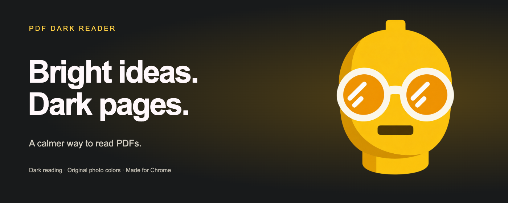
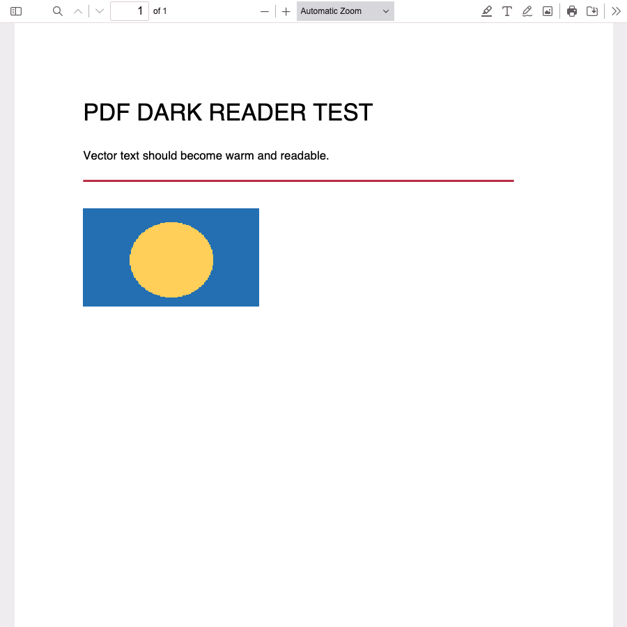
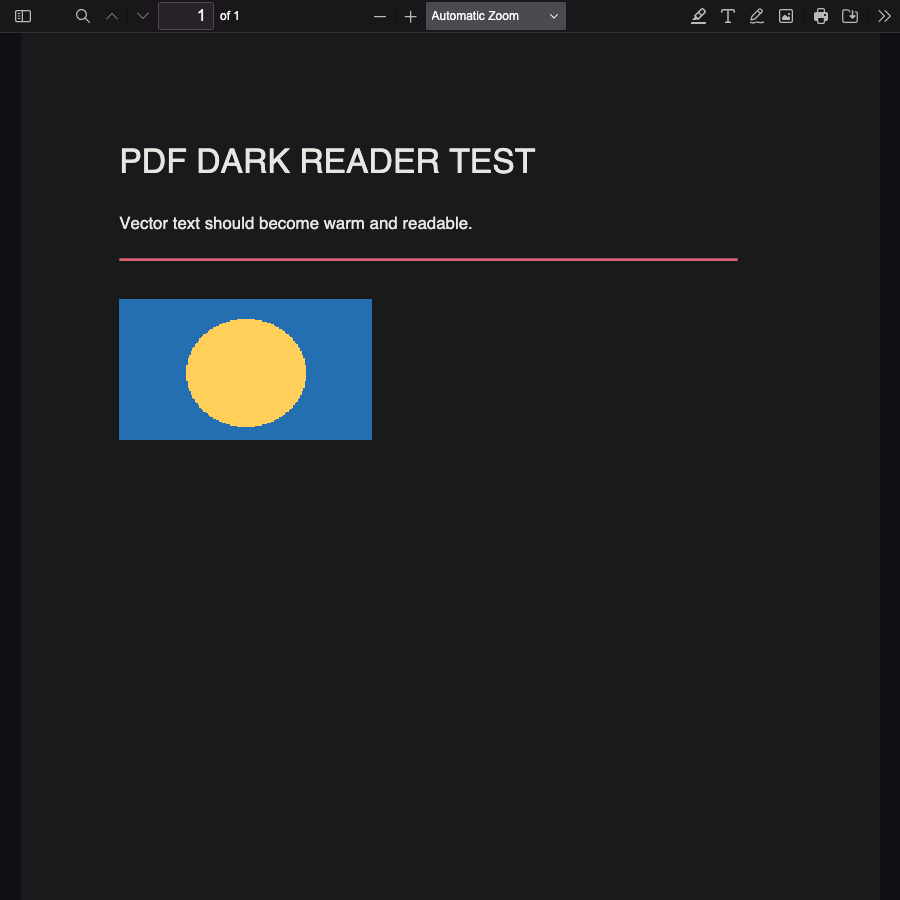
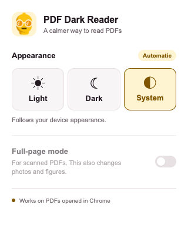

# PDF Dark Reader



**A calmer PDF reader for Chrome.** Turn bright pages dark while keeping embedded photos and figures in their original colors.

[](https://github.com/jedieason/pdf-dark-reader/actions/workflows/ci.yml) · [Download](https://github.com/jedieason/pdf-dark-reader/releases/latest) · [Contribute](CONTRIBUTING.md) · Apache-2.0

| Original PDF | PDF Dark Reader |
|:---:|:---:|
|  |  |

PDF Dark Reader builds on [Mozilla PDF.js](https://github.com/mozilla/pdf.js), so you keep familiar PDF features such as search, zoom, text selection, download, and printing. Its dark mode changes simple PDF text and vector colors *before* PDF.js paints them. Raster images are left alone. For image-only scans, a separate full-page switch is available.



## Features

- **Light / Dark / System:** use original colors, enable dark reading, or follow your device theme.
- **Photo-safe dark mode:** remaps ordinary text and vector fills without inverting embedded raster images.
- **Scanned PDF fallback:** full-page mode inverts the entire canvas, including images, for pages that are one big scan.
- **Live switching:** open PDF tabs update when you change the popup setting.
- **Local and web PDFs:** PDF.js handles direct PDF links and local files after you grant Chrome file URL access.
- **No analytics:** this fork removes PDF.js extension telemetry. See [Privacy](PRIVACY.md).

## Install

Chrome 128 or newer is required. This project is not in the Chrome Web Store yet.

1. [Download the latest release](https://github.com/jedieason/pdf-dark-reader/releases/latest) and unzip it, or clone this repository.
2. Open `chrome://extensions` in Chrome and enable **Developer mode**.
3. Click **Load unpacked** and choose the **`extension/`** folder. If you downloaded the release ZIP, choose its extracted folder containing `manifest.json`.
4. Pin the PDF Dark Reader icon for quick access.
5. To open PDFs from your computer, open the extension's **Details** page and enable **Allow access to file URLs**.

Open a PDF in Chrome and choose a mode from the popup:

| Mode | What happens |
|---|---|
| **Light** | Original PDF colors; dark rendering is off. |
| **Dark** | Dark page and remapped text/vector colors. |
| **System** | Follows your device's light or dark appearance. |

For a scanned page that stays white in Dark mode, turn on **Full-page mode**. Turn it off again for PDFs containing photos or color-sensitive figures.

> **Note:** Light mode still opens PDFs in PDF.js. It turns off the color transformation; it does not switch back to Chrome's built-in PDF viewer.

## How it works

```text
PDF URL or file
     ↓
PDF.js Chromium extension routes it to the viewer
     ↓
PDF.js parses and renders the page
     ├─ text and simple vector colors → dark color mapper
     └─ embedded raster images      → original pixels
     ↓
Canvas + accessible PDF.js controls
```

The source patch is deliberately small. [`scripts/build.mjs`](scripts/build.mjs) fetches a pinned PDF.js commit, patches its canvas renderer, builds the Chromium extension, and copies in the popup and theme files. The complete, loadable build is committed in [`extension/`](extension/), so installation needs no Node.js or build step. Printing and downloading use original PDF colors.

## Develop

You need Node.js 24.15 or newer, Git, and npm. From the repository root:

```sh
npm test
npm run build
```

`npm test` checks the color mapper, settings, and that every packaged service-worker import exists. `npm run build` downloads the pinned PDF.js source into ignored `.cache/pdfjs`, installs upstream dependencies, and replaces `extension/` with a fresh build. The pinned commit is `7ab3cb01dc9ac8c367e371d945d8b7c6488efeb6`.

To build against an existing checkout of that commit:

```sh
node scripts/build.mjs --pdfjs /path/to/pdf.js
```

The key directories are:

| Directory | Purpose |
|---|---|
| [`src/`](src/) | Popup, settings, color mapper, and viewer theme. |
| [`scripts/`](scripts/) | Reproducible PDF.js build and icon generation. |
| [`extension/`](extension/) | Ready-to-load Chrome extension, including PDF.js assets. |
| [`test/`](test/) | Fast Node.js tests. |
| [`docs/`](docs/) | Real Chrome screenshots of a sample PDF. |

## Current limitations and roadmap

PDFs are varied. Smart dark mode currently handles the blank page background and simple solid colors. Patterns, gradients, and some annotation UI can still appear in their original colors. Full-page mode is a manual fallback for scans and inverts images too. Some sites with unusual embedded-PDF flows may need you to open the PDF directly in a tab.

Useful next steps include pattern and gradient support, automatic scan detection, per-document preferences, and more visual regression samples. See [Contributing](CONTRIBUTING.md) if you want to help.

## Privacy and license

The extension needs access to PDF URLs across sites so it can route PDFs into the viewer. Your appearance preference is stored through Chrome's sync storage. The project does not include an analytics endpoint or send document contents to a project server. Read the [privacy notes](PRIVACY.md) and [security policy](SECURITY.md) for details.

This repository's original code and assets are licensed under [Apache 2.0](LICENSE). The bundled PDF.js code and assets retain their upstream notices and license; see [NOTICE.md](NOTICE.md) and [`extension/LICENSE`](extension/LICENSE).

## Brand and Chrome Web Store assets

The yellow glasses mascot is the shared logo for the extension and store artwork.
The supplied original is preserved in `assets/brand-source.png`; `assets/logo.png`
is its transparent production version. See [brand notes](assets/BRAND.md).

Store icons, four screenshots, promotional images, listing copy, and the upload ZIP
are in [`chrome-store-submission/`](chrome-store-submission/). Regenerate with:

```sh
node scripts/generate-icons.mjs
node scripts/prepare-store.mjs
python3 scripts/package-store.py
```

The render scripts use Playwright and Chrome; set `PLAYWRIGHT_PATH` and
`CHROME_PATH` for your installation. Icon generation preserves the same artwork
at 16, 32, 48, and 128 pixels.
